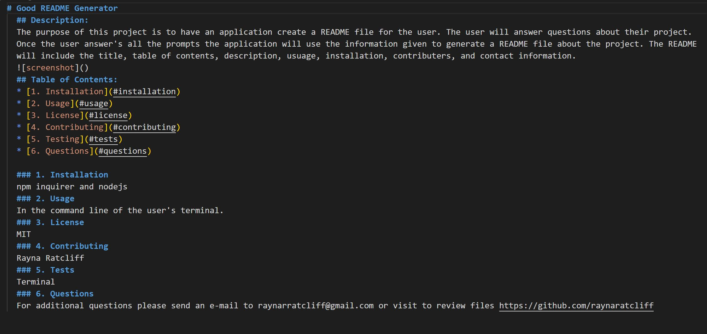

# 09 Node.js Homework: Professional README Generator

## Application 

The purpose of this project is to have an application create a README file for the user. The user will answer questions about their project. Once the user answer's all the prompts the application will use the information given to generate a README file about the project. The README will include the title, table of contents, description, usuage, installation, contributers, and contact information.  

The application will be invoked by using the following command:

```bash
node index.js
```


## Walk-Through Video 

[](https://www.youtube.com/watch?v=ou15dMtKq0I)

## User Story

```md
AS A developer
I WANT a README generator
SO THAT I can quickly create a professional README for a new project
```

## Technologies Used:
Javascript 

NPM Packgage Inquirer 

Node.js


### Walkthrough Video: 27%


## Links 

Github Repository: https://github.com/raynaratcliff/Good-README-Generator.git

Github pages: https://raynaratcliff.github.io/Good-README-Generator/

---

© 2021 Trilogy Education Services, LLC, a 2U, Inc. brand. Confidential and Proprietary. All Rights Reserved.
